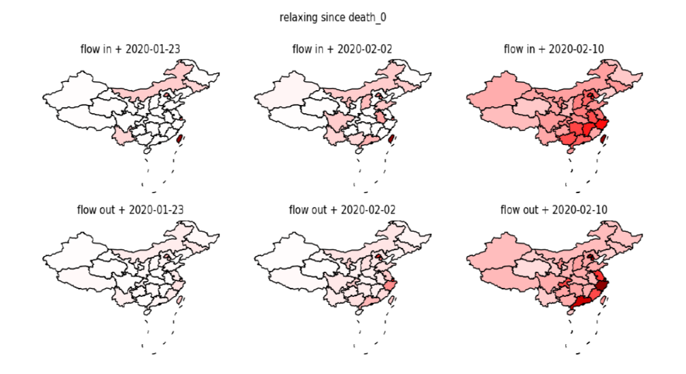

# Evaluating-the-effect-of-city-lockdown
Evaluating the effect of city lockdown

The program includes the raw data of COVID-19 infection number (Wuhan_nCoV分省20200308.xlsx), the model training code (latent_sir4.py), the baidu migration index data (moving_average_population_flow.xlsx) and the code for counterfactual analysis (simulation_and_evaluation_back.py). To successfully run the program, firstly run the model training code to generate the training result, based on which, then, run the code for counterfactual analysis.

